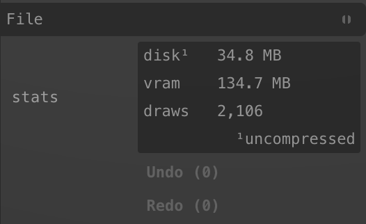
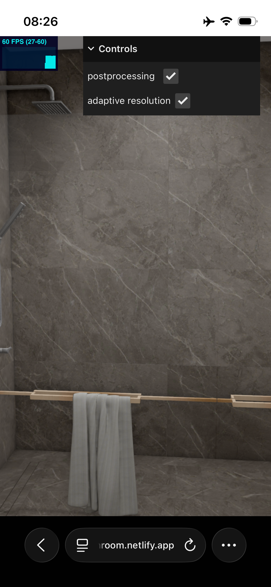
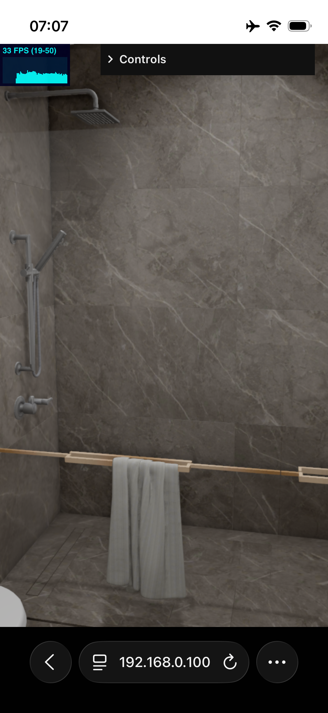
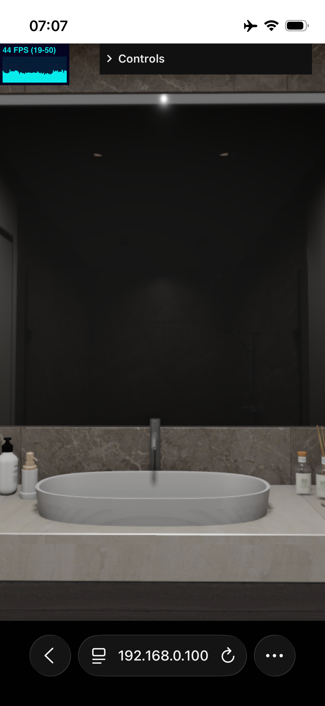

# 3D Viewer

### Сделано

- Подключил HDR окружение, сгенерированное из самой сцены, чтобы переиспользовать его и для отражений
- Поставил 3 источника света: один RectArea Light и два SpotLight, один из них даёт тени
- Сделал постпроцесс с AO + Bloom + TRAA. SSGI и SSR слишком дороги для этой сцены, вместо SSR использовал Box
  Projection, чтобы имитировать реалистичные отражения
- Выбрал AgX Tone Mapping, так как он лучше работает с пересветами
- Реализован AdaptiveResolution, чтобы держать FPS в заданных пределах за счёт динамического pixelRatio
- Добавлен ViewerControls для управления камерой; используются collider-meshes для улучшения поведения контролов

### Дальше

- В сцене много draw-calls, дальше планирую поработать с BatchedMesh сделать систему, объединяющую меши по материалам,
  чтобы сократить число draw-calls.
- Разделил бы постпроцессинг на WebGL и WebGPU: под WebGPU писал бы отдельно, так как у него много преимуществ (
  compute-шейдеры, work-groups), которых нет в WebGL. Для WebGL-варианта взял бы библиотеку postprocessing — она лучше
  оптимизирована под WebGL.
- Доработал бы RenderGraph, чтобы удобнее было работать с пассами.
- Ещё FPS падает из-за того, что в сцене много transparent-мешей — это отключает нативное HSR на TBDR. Поработал бы над
  тем, чтобы эффективнее рендерить прозрачные меши.
- Улучшил бы оптимизацию модели: разные размеры текстур для mobile и desktop + динамическая подгрузка высококачественных
  текстур
- Ещё попробовал бы BabylonJS там многое доступно из коробки.

### 3D model optimisation

У нескольких meshes неправильная ориентация граней (face orientation). Требуется исправление в Blender.

- Почистил модель в Blender и по минимуму исправил некоторые недочёты. Также выполнил оптимизацию для ускорения загрузки
  модели, уменьшив размер файла примерно с 35 МБ до 5 МБ.
- В дальнейшем можно дополнительно поработать над очисткой модели: сократить количество meshes и vertices, а также
  пересмотреть размеры текстур, чтобы ещё лучше оптимизировать соотношение качества и размера файла.

### Замеры по FPS на iPhone 13 mini:

